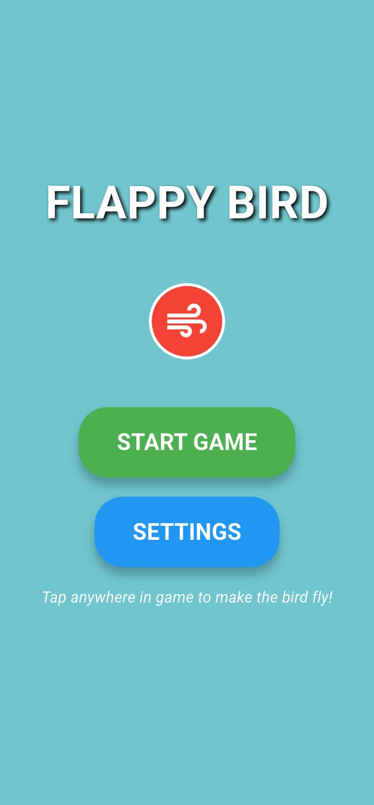
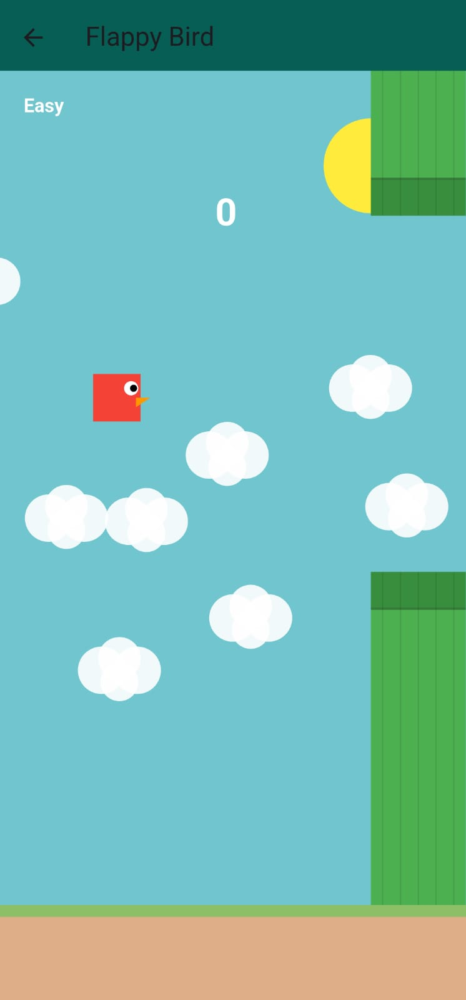
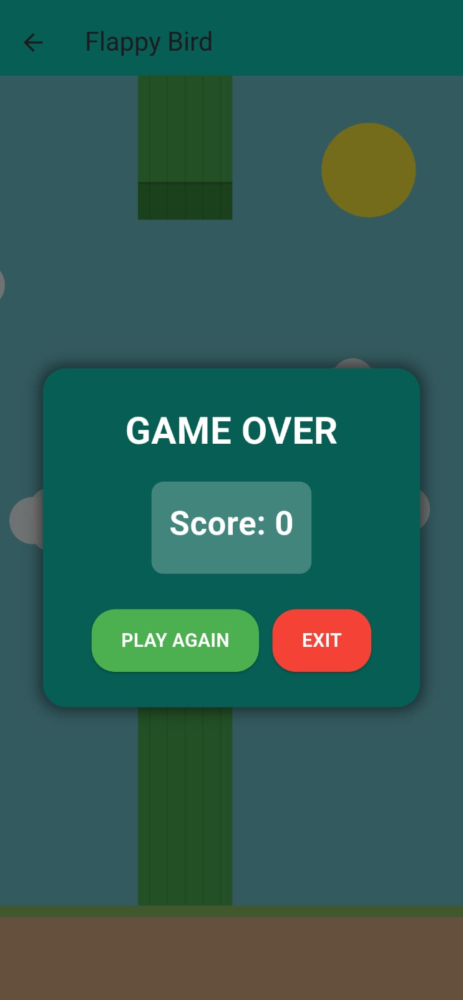
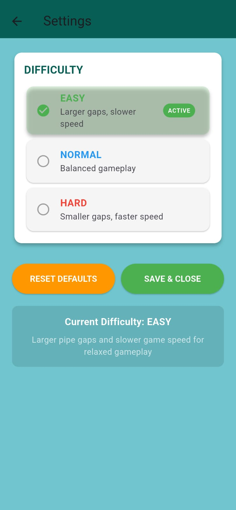

# Flappy Bird - Flutter Edition

A beautifully crafted **Flappy Bird clone** built with **Flutter** and the **Flame game engine**, featuring smooth animations, dynamic difficulty settings, and a polished user experience.

---

## 🎮 Features

### 🧩 Core Gameplay
- **Classic Flappy Bird Mechanics:** Tap to flap and navigate through pipes  
- **Smooth Physics:** Realistic bird movement with gravity and momentum  
- **Progressive Difficulty:** Game speed increases as you score higher  
- **Score Tracking:** Real-time score display with visual feedback  

---

### ⚙️ Customization & Settings
- **Multiple Difficulty Levels:**
  - 🟢 **Easy:** Larger pipe gaps, slower speed – perfect for beginners  
  - 🟡 **Normal:** Balanced gameplay for casual players  
  - 🔴 **Hard:** Smaller pipe gaps, faster speed – for the ultimate challenge  
- **Persistent Settings:** Your preferences are saved locally and persist between sessions  

---

### 💻 Technical Excellence
- **Built with Flame Engine:** High-performance 2D game development  
- **Responsive Design:** Works seamlessly across different screen sizes  
- **Clean Architecture:** Well-organized codebase with separation of concerns  
- **Collision Detection:** Precise hit detection for fair gameplay  

---

### 🎨 Visual Appeal
- **Beautiful Backgrounds:** Scrolling cloud backgrounds with parallax effect  
- **Smooth Animations:** Fluid bird flapping and pipe movement  
- **Polished UI:** Clean overlays for start screen, game over, and settings  
- **Consistent Theme:** Cohesive color scheme and visual design  

---

## 🚀 Getting Started

### 🧰 Prerequisites
- [Flutter SDK](https://flutter.dev/docs/get-started/install) (v3.0 or higher)  
- [Dart](https://dart.dev/get-dart) (v2.17 or higher)  

---

### ▶️ Installation

# Clone this repository
```bash
git clone https://github.com/Mega-Gangar/Flappy-Game.git
```
# Navigate to the project directory
```bash
cd flappy-bird-flutter
```
# Get dependencies
```bash
flutter pub get
```
# Run the app
```bash
flutter run
```
## Screenshots

### Home Screen


### Gameplay Screen



### Setting

